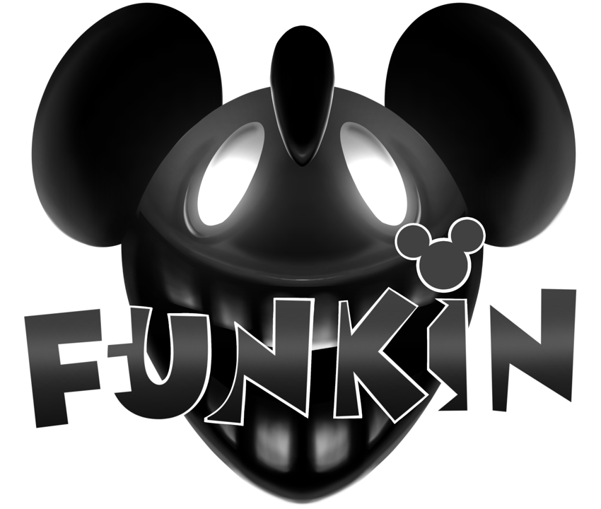

# Funkin.avi (V2.5) - Source code

## Installation:

Refer to [the Build Instructions](./BUILDING.md)
Download the original mod [here](https://gamejolt.com/games/funkin-avi/710505)

## Credits:
* Yama Haki/Toko - Creator, Owner, Director, Composer, PlayTester
* ThatOneSillyGuy // Don - Ex-Director, Ex-Programmer, Artist, Animator, Charter
* Domingo - Director, Main Artist, Animator, Cutscenes, PlayTester
* Jason - Co-Director, Artist, Animator, Programmer (and playtested a tiny bit)
* JDrive - Ex-Co-Director, Cycled Sins art & Owner of Walt
* Writer Anon - Co-director, Rewrote story of the mod, absolute fucking legend
* KKCopinXD - Icon Artist & Concept Menu Artist
* GreyDoodlez - Artist
* 8tastic! - Pixel Artist for Everett on Malfunction
* PlayerTheMobile - Discord Icon Artist
* Ms.IDK - Artist & Owner of White Noise and RS
* BlueFishAnimation - Freeplay Menu Art
* General Secretary Monika - Artist
* BladzAMC_emerald - Artist and Playtester
* Moe - Artist, Animator And Cutscenes
* Teelbe - Artist
* Just_Kuro - Artist
* Kyuxhtysu - Artist & Redesigned Lilith
* 0yxz - Artist for Settings & Info menus, Carried the mod heavily with all the assets we were missing
* yahfe - Hunter Goofy Artist
* Austin W. Productions - Artist, Owner of Mr. Smiles & Professionally Horny
* Gemmie Femmie - Concept Artist, Death Screen Artist & Playtester
* Purg - Charter & Voice Actor
* Goober Man - Lead Programmer, The one dude no body invited
* MalyPlus - Assistant Programmer
* Mr. Chaos - Programmer, created the Spectrum Visualizer used in the Freeplay menu
* BonoanAnything - Evilrett VA, made lyrics for Delusional & trailers
* Sayan Sama - Made Twisted Grins V1 (Legacy) and Credit Music
* JBlitz - Composer
* Obscurity - Composer of Malfunction, War Dilemma & almost all the Episode 1 tracks
* ForFurtherNotice - Composer of Pause Themes
* Lasagnacat - Ex-Composer
* FR3SHMoure - Composer (Mostly well known for Delusional)
* Dreupy - Charter
* Mouse - Made chromatics for Lilith & Everett
* JustJustin - Made Ricky Chromatic

## Psych Engine Credits
* Shadow Mario - Programmer
* Riveren - Artist
### Special Thanks
* bbpanzu - Ex-Programmer
* Yoshubs - Ex-Programmer
* SqirraRNG - Crash Handler and Base code for Chart Editor's Waveform
* KadeDev - Fixed some cool stuff on Chart Editor and other PRs
* iFlicky - Composer of Psync and Tea Time, also made the Dialogue Sounds
* PolybiusProxy - .MP4 Video Loader Library (hxCodec)
* Keoiki - Note Splash Animations
* Smokey - Sprite Atlas Support
* Nebula the Zorua - some Lua reworks
* superpowers04 - LUA JIT Fork
